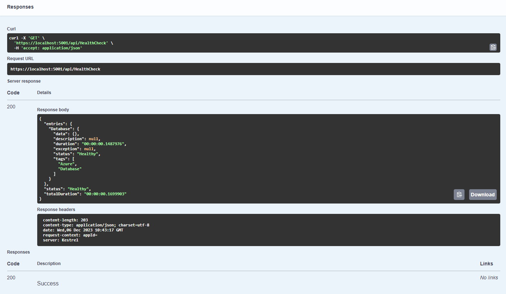

# :syringe: Service Health Check
There are some situations where we want to check not only it the specific instance of the API works correctly but also if the whole system is working as expected. For example, if we have a microservice that depends on a database, we want to check if the database is up and running before we start the microservice. This is where the Service Health Check comes in handy.

## Getting Started
To use `Accessory.Builder.ServiceHealthCheck`, you need to add the following line in `Extension` class in the `Template.Infrastructure` project:

```
    class Program
    {
        public static Task Main(string[] args)
            => CreateWebHostBuilder(args).Build().RunAsync();
        
        public static IWebHostBuilder CreateWebHostBuilder(string[] args)
        {
            return WebHost.CreateDefaultBuilder(args)
                .ConfigureAppConfiguration((context, config) =>
    ...
    .AddServiceHealthChecks()
    ...
```

## How to use?

Use the following code to check if the service is up and running with it's dependencies:

```
    public class HealthCheckController : BaseController
    {
        private readonly HealthCheckService _healthCheckService;
        private readonly HealthCheckOptions _healthCheckOptions;
        private readonly ILogger<HealthCheckController> _logger;

        public HealthCheckController(
            HealthCheckService healthCheckService,
            IOptions<HealthCheckOptions> healthCheckOptions,
            ILogger<HealthCheckController> logger)
        {
            _healthCheckService = healthCheckService;
            _healthCheckOptions = healthCheckOptions.Value;
            _logger = logger;
        }

        /// <summary>
        /// Provides health check report
        /// </summary>
        /// <returns>Health check detailed report</returns>
        [HttpGet]
        [ProducesResponseType(StatusCodes.Status200OK)]
        [Produces("application/json", Type = typeof(HealthReport))]
        public async Task<IActionResult> Index()
        {
            var result = await _healthCheckService.CheckHealthAsync(_healthCheckOptions.Predicate);
            return Ok(result);
        }
```
Example response:
```
{
  "entries": {
    "Database": {
      "data": {},
      "description": null,
      "duration": "00:00:00.1487976",
      "exception": null,
      "status": "Healthy",
      "tags": [
        "Azure",
        "Database"
      ]
    }
  },
  "status": "Healthy",
  "totalDuration": "00:00:00.1699903"
}
```

